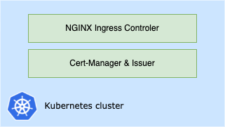

# Setup the Kubernetes cluster



## Kubernetes cluster

Before anything else, we need a kubernetes cluster. I use Azure AKS but you can use any other kubernetes cluster.

```bash
$ kubectl get nodes          
NAME                                STATUS   ROLES   AGE     VERSION
aks-agentpool-16711910-vmss000000   Ready    agent   5m16s   v1.22.6
aks-agentpool-16711910-vmss000001   Ready    agent   7m4s    v1.22.6
aks-agentpool-16711910-vmss000002   Ready    agent   6m56s   v1.22.6
```

## Nginx ingress controller

Install the NGINX ingress controller:
```bash
helm upgrade --install ingress-nginx ingress-nginx \
  --repo https://kubernetes.github.io/ingress-nginx \
  --namespace ingress-nginx --create-namespace
```

Check that all is running:
```bash
$ kubectl get all -n ingress-nginx

NAME                                            READY   STATUS    RESTARTS   AGE
pod/ingress-nginx-controller-5849c9f946-pth9c   1/1     Running   0          29s

NAME                                         TYPE           CLUSTER-IP     EXTERNAL-IP   PORT(S)                      AGE
service/ingress-nginx-controller             LoadBalancer   10.0.136.248   20.82.74.3    80:31969/TCP,443:30518/TCP   29s
service/ingress-nginx-controller-admission   ClusterIP      10.0.88.28     <none>        443/TCP                      29s

NAME                                       READY   UP-TO-DATE   AVAILABLE   AGE
deployment.apps/ingress-nginx-controller   1/1     1            1           29s

NAME                                                  DESIRED   CURRENT   READY   AGE
replicaset.apps/ingress-nginx-controller-5849c9f946   1         1         1       29s
```

If not already present, add the following annotation to the `nginx` IngressClass:

```bash 
kubectl annotate ingressClass nginx ingressclass.kubernetes.io/is-default-class='true'
```

The ingress controller is exposed with a service of type loadbalancer. The IP of the loadbalancer provisionned on Azure is `20.82.74.3`.

I configure the wildcard DNS `*.ssotest.perelle.com` pointing on this IP.

## Cert manager

Install cert manager:
```bash
helm repo add jetstack https://charts.jetstack.io
helm repo update
helm install \
  cert-manager jetstack/cert-manager \
  --namespace cert-manager \
  --create-namespace \
  --version v1.8.0 \
  --set installCRDs=true
```

Create the `letsencrypt-production` ClusterIssuer. Adapt the manifest in `cert-manager/letsencrypt-production-cluster-issuer.yml`:
```yml
apiVersion: cert-manager.io/v1
kind: ClusterIssuer
metadata:
  name: letsencrypt-production
spec:
  acme:
    # Staging server
    # server: https://acme-staging-v02.api.letsencrypt.org/directory
    # Production server
    server: https://acme-v02.api.letsencrypt.org/directory 
    # You must replace this email address with your own.
    # Let's Encrypt will use this to contact you about expiring
    # certificates, and issues related to your account.
    email: <YOUR_EMAIL>
    privateKeySecretRef:
      # Secret resource that will be used to store the account's private key.
      name: letsencrypt-production
    solvers:
    - http01:
        ingress:
          class: nginx
```
You must particularly adapt the email address ! \
You can make some tests using the staging Let's Encrypt server.

Then deploy your issuer:
```bash
kubectl apply -f cert-manager/letsencrypt-production-cluster-issuer.yml -n cert-manager
```

You should have something like that:

```bash
$ kubectl get all,ClusterIssuers -n cert-manager 

NAME                                          READY   STATUS    RESTARTS   AGE
pod/cert-manager-6bbf595697-96x79             1/1     Running   0          3m47s
pod/cert-manager-cainjector-6bc9d758b-9j75f   1/1     Running   0          3m47s
pod/cert-manager-webhook-586d45d5ff-6kph4     1/1     Running   0          3m47s

NAME                           TYPE        CLUSTER-IP     EXTERNAL-IP   PORT(S)    AGE
service/cert-manager           ClusterIP   10.0.119.125   <none>        9402/TCP   3m47s
service/cert-manager-webhook   ClusterIP   10.0.127.235   <none>        443/TCP    3m47s

NAME                                      READY   UP-TO-DATE   AVAILABLE   AGE
deployment.apps/cert-manager              1/1     1            1           3m47s
deployment.apps/cert-manager-cainjector   1/1     1            1           3m47s
deployment.apps/cert-manager-webhook      1/1     1            1           3m47s

NAME                                                DESIRED   CURRENT   READY   AGE
replicaset.apps/cert-manager-6bbf595697             1         1         1       3m47s
replicaset.apps/cert-manager-cainjector-6bc9d758b   1         1         1       3m47s
replicaset.apps/cert-manager-webhook-586d45d5ff     1         1         1       3m47s

NAME                                                   READY   AGE
clusterissuer.cert-manager.io/letsencrypt-production   True    2m22s
```

> Additional sources about SSL in Kubernetes:
> - https://blog.zwindler.fr/2018/03/27/generez-automatiquement-vos-certificats-lets-encrypt-dans-kubernetes/
> - https://cert-manager.io/docs/configuration/acme/#creating-a-basic-acme-issuer