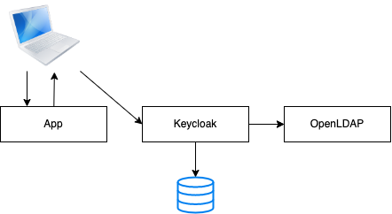
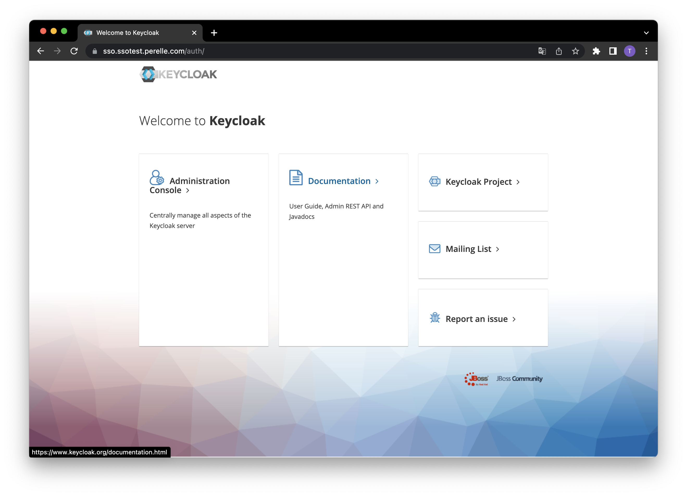
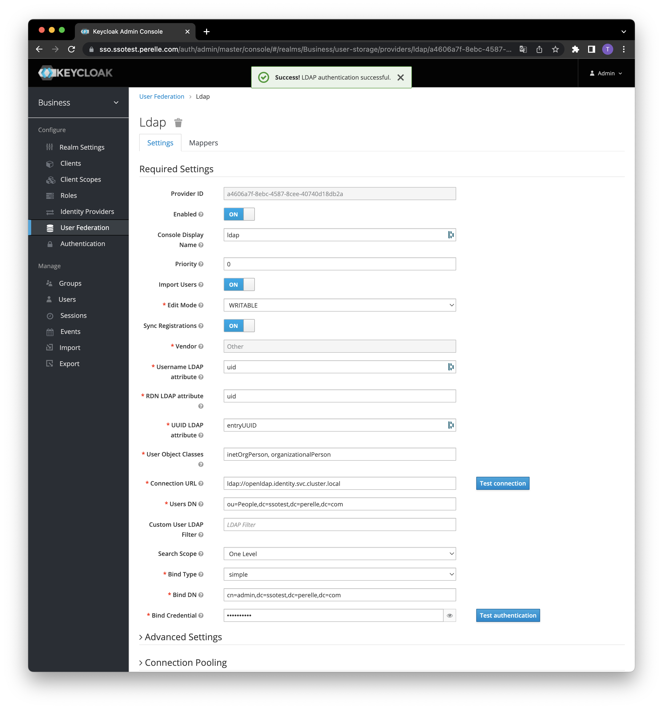
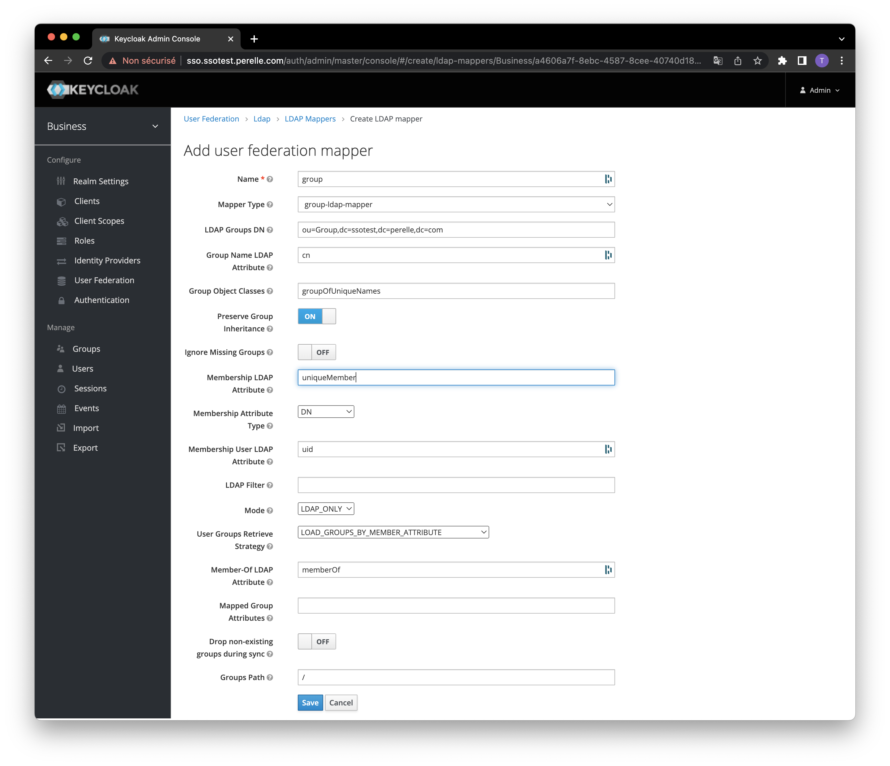
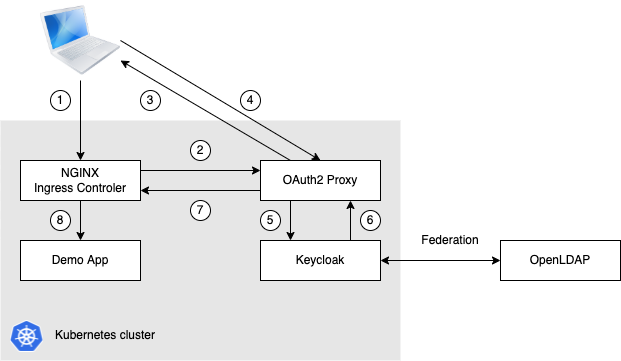
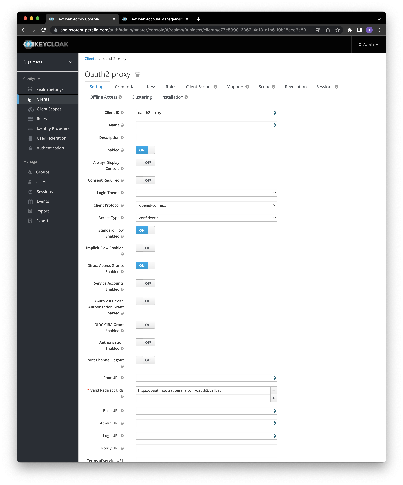
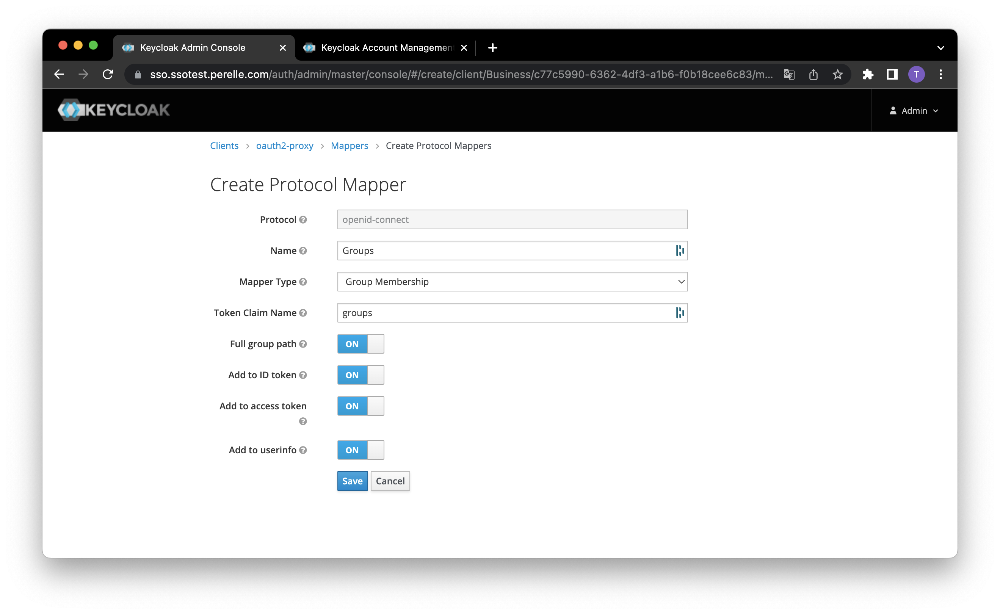
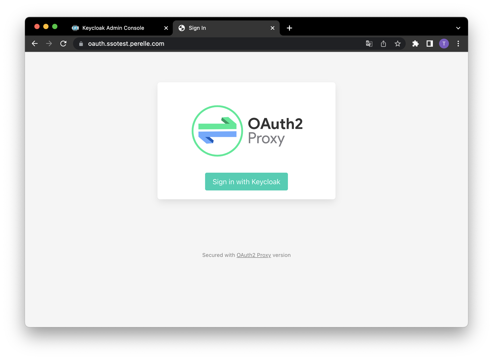

# Deploy the lab

The SSO solution is composed of [Keycloak](https://www.keycloak.org) and [OpenLDAP](https://www.openldap.org). 



I rely on the [talkingquickly](https://www.talkingquickly.co.uk/kubernetes-sso-a-detailed-guide) articles for the installation.

## OpenLDAP

### Installation

Configure helm values in `openldap/values-openldap.yml`. 

```yml
# Default configuration for openldap as environment variables. These get injected directly in the container.
# Use the env variables from https://github.com/osixia/docker-openldap#beginner-guide
env:
  LDAP_ORGANISATION: "Thomas Perelle's Demo"
  LDAP_DOMAIN: "ssotest.perelle.com"
  LDAP_BACKEND: "hdb"
  LDAP_TLS: "true"
  LDAP_TLS_ENFORCE: "false"
  LDAP_REMOVE_CONFIG_AFTER_SETUP: "true"
  LDAP_READONLY_USER: "true"
  LDAP_READONLY_USER_USERNAME: readonly
  LDAP_READONLY_USER_MASSWORD: password

# Default Passwords to use, stored as a secret. If unset, passwords are auto-generated.
# You can override these at install time with
# helm install openldap --set openldap.adminPassword=<passwd>,openldap.configPassword=<passwd>
adminPassword: password
configPassword: password

# Custom openldap configuration files used to override default settings
customLdifFiles:
  0-initial-ous.ldif: |-
    dn: ou=People,dc=ssotest,dc=perelle,dc=com
    objectClass: organizationalUnit
    ou: People

    dn: ou=Group,dc=ssotest,dc=perelle,dc=com
    objectClass: organizationalUnit
    ou: Group
```

- With default values the base domain of the cluster is `dc=ssotest,dc=perelle,dc=com`.
- 2 `OrganizationalUnit`'s will be created in the LDAP, `People` and `Group`.

Install OpenLDAP
```bash
$ helm upgrade --install openldap ./charts/openldap --values ./openldap/values-openldap.yml --namespace identity --create-namespace

Release "openldap" does not exist. Installing it now.
NAME: openldap
LAST DEPLOYED: Wed May  4 09:35:59 2022
NAMESPACE: identity
STATUS: deployed
REVISION: 1
TEST SUITE: None
NOTES:
OpenLDAP has been installed. You can access the server from within the k8s cluster using:

  openldap.identity.svc.cluster.local:389


You can access the LDAP adminPassword and configPassword using:

  kubectl get secret --namespace identity openldap -o jsonpath="{.data.LDAP_ADMIN_PASSWORD}" | base64 --decode; echo
  kubectl get secret --namespace identity openldap -o jsonpath="{.data.LDAP_CONFIG_PASSWORD}" | base64 --decode; echo


You can access the LDAP service, from within the cluster (or with kubectl port-forward) with a command like (replace password and domain):
  ldapsearch -x -H ldap://openldap.identity.svc.cluster.local:389 -b dc=example,dc=org -D "cn=admin,dc=example,dc=org" -w $LDAP_ADMIN_PASSWORD


Test server health using Helm test:
  helm test openldap


You can also consider installing the helm chart for phpldapadmin to manage this instance of OpenLDAP, or install Apache Directory Studio, and connect using kubectl port-forward.
```

### Tests

Expose the LDAP locally:
```bash
kubectl port-forward --namespace identity \
    $(kubectl get pods -n identity --selector='release=openldap' -o jsonpath='{.items[0].metadata.name}') \
    3890:389
```

Test that the LDAP works using the `ldapsearch` CLI:
```bash
$ ldapsearch -x -H ldap://localhost:3890 -b dc=ssotest,dc=perelle,dc=com -D "cn=admin,dc=ssotest,dc=perelle,dc=com" -w password
```

This return the content of our LDAP:
```ldif
# extended LDIF
#
# LDAPv3
# base <dc=ssotest,dc=perelle,dc=com> with scope subtree
# filter: (objectclass=*)
# requesting: ALL
#

# ssotest.perelle.com
dn: dc=ssotest,dc=perelle,dc=com
objectClass: top
objectClass: dcObject
objectClass: organization
o: Thomas Perelle's Demo
dc: ssotest

# admin, ssotest.perelle.com
dn: cn=admin,dc=ssotest,dc=perelle,dc=com
objectClass: simpleSecurityObject
objectClass: organizationalRole
cn: admin
description: LDAP administrator
userPassword:: e1NTSEF9SklHbHoxbHJsRXJQS3J4cWl6ODJGeURXTzgrUnNlWnU=

# readonly, ssotest.perelle.com
dn: cn=readonly,dc=ssotest,dc=perelle,dc=com
cn: readonly
objectClass: simpleSecurityObject
objectClass: organizationalRole
userPassword:: e1NTSEF9djg3SUg5RDAySkYvOVZSQVNUdHJJZEtzSnZoQU9kZlc=
description: LDAP read only user

# People, ssotest.perelle.com
dn: ou=People,dc=ssotest,dc=perelle,dc=com
objectClass: organizationalUnit
ou: People

# Group, ssotest.perelle.com
dn: ou=Group,dc=ssotest,dc=perelle,dc=com
objectClass: organizationalUnit
ou: Group

# search result
search: 2
result: 0 Success

# numResponses: 6
# numEntries: 5
```

## Keycloak

Adapt the configuration in `keycloak/values-keycloak.yml`, especially the domain to be concordant with your environement and the OpenLDAP deployment.

```bash
helm repo add codecentric https://codecentric.github.io/helm-charts
helm upgrade --install keycloak codecentric/keycloak --values keycloak/values-keycloak.yml
```

Navigate to the DNS your configured in keycloak configuration, here is `https://sso.ssotest.perelle.com`:



If it doesn't work, check if the `keycloak` ingress has been processed in the logs of the nginx controller. It may be some [issues arround the IngressClass](https://kubernetes.github.io/ingress-nginx/).

Note that the access for Keycloak management is separated from the access as a service user.

You can logging in into the administration console using the account you configured in [keycloack/values-keycloak.yml](keycloack/values-keycloak.yml).

> Additionnal Sources:
> - [Keycloak helm chart configuration](https://github.com/codecentric/helm-charts/tree/master/charts/keycloak)
> - [NGINX ingress controller troubleshooting](https://kubernetes.github.io/ingress-nginx/troubleshooting/)

## Linking Keycloak with OpenLDAP

We are going to setup the federation between Keycloak and OpenLDAP.

In this example, we imagine that the users lifecycle in the company is managed by a dedicated team. Our SSO solution relies on this referential for identities.

### Create a realm

Connect as admin in the administration console and create a new realm call `Business`. It's always a good thing to seperate administration and business usages.

### Configure federation

Then go in `User federation`.

Then setup the `ldap` federation according your OpenLDAP configuration.



Use `Test connection` and `Test authentication` buttons to check if the federation is working.

Save federation settings and enter the `Mappers` tab of the `ldap` federation.

Click the `Create` button to create the `group` mappers of type `group-ldap-mapper` as described bellow:



### Test

Create a new user in the `Business` realm.

Use ldapsearch to check if this new user has been well created in the LDAP:

```bash
# Forward the OpenLDAP port locally
kubectl port-forward --namespace identity \
  $(kubectl get pods -n identity --selector='release=openldap' -o jsonpath='{.items[0].metadata.name}') \
  3890:389

# Query to check if the new user exists
$ ldapsearch -x -H ldap://localhost:3890 -b dc=ssotest,dc=perelle,dc=com -D "cn=admin,dc=ssotest,dc=perelle,dc=com" -w password

[...]
# thomas, People, ssotest.perelle.com
dn: uid=thomas,ou=People,dc=ssotest,dc=perelle,dc=com
uid: thomas
objectClass: inetOrgPerson
objectClass: organizationalPerson
mail: thomas@perelle.com
sn: perelle
cn: thomas
[...]
```

Now create a new `team` group from the left menu, always in the `Business` realm.

From the `Users` menu, select the new created user and add it in the `team` group.

Re-run the ldapsearch command and see that the new group is also synchronized:

```bash
[...]
# team, Group, ssotest.perelle.com
dn: cn=team,ou=Group,dc=ssotest,dc=perelle,dc=com
objectClass: groupOfUniqueNames
uniqueMember: cn=empty-membership-placeholder
uniqueMember: uid=thomas,ou=People,dc=ssotest,dc=perelle,dc=com
cn: team
[...]
```

### Connection

The SSO solution is up and running. 
- Keycloack welcome page: https://sso.ssotest.perelle.com/
- Keycloack Administration console: https://sso.ssotest.perelle.com/auth/admin/master/console
- User login page for each realm:
  - `Master`: https://sso.ssotest.perelle.com/auth/realms/master/account
  - `Business`: https://sso.ssotest.perelle.com/auth/realms/Business/account

All this done, you can deploy secured applications.

## Secured applications

### OAuth2 Proxy

Some products or applications integrate natively the capability to configure OAuth2 provider. For the others, we can use [OAuth2 Proxy](https://oauth2-proxy.github.io/oauth2-proxy/) to secure the application at the edge with ingress annotations.

#### Process overview



1. The customer send a request for the demo app
2. The ingress controler asks OAuth2 Proxy to check both authentication and authorization with Keycloak
3. If the customer is not already anthenticated, OAuth2 Proxy asks him to login 
4. The customer gives its credentials
5.
6.
7. 
8. 

#### Installation

Create a new client application `oauth2-proxy` in Keycloak:



Save and go to the `Credentials` tab to note the associated secret.

In the `Mappers` tab, create a new `Groups`:



Now we can prepare the deployment of OAuth2 Proxy configuring the value file `oauth2-proxy/values-oauth2-proxy.yml`, mainly `clientID`, `clientSecret`, `cookieSecret` and the DNS.

Then deploy OAuth2 Proxy with the embedded chart:

```bash 
helm repo add oauth2-proxy https://oauth2-proxy.github.io/manifests
helm upgrade --install oauth2-proxy oauth2-proxy/oauth2-proxy --values oauth2-proxy/values-oauth2-proxy.yml
```

We get the `Sign in with Keycloak` option when we access to OAuth2 Proxy ingress domain at https://oauth.ssotest.perelle.com



## Demo app

We use [NGINX](https://nginx.org/en/) as demo application to check if the SSO solution, including OAuth2 Proxy, is working well. In this example we want that users login with Keycloak before they can access the welcome page of NGINX.

Adapt the configuration in `nginx-demo-app/values-nginx.yml`.

Then deploy the demo application:

```bash 
helm repo add bitnami https://charts.bitnami.com/bitnami
helm upgrade --install nginx-demo-app bitnami/nginx --values nginx-demo-app/values-nginx.yml
```
